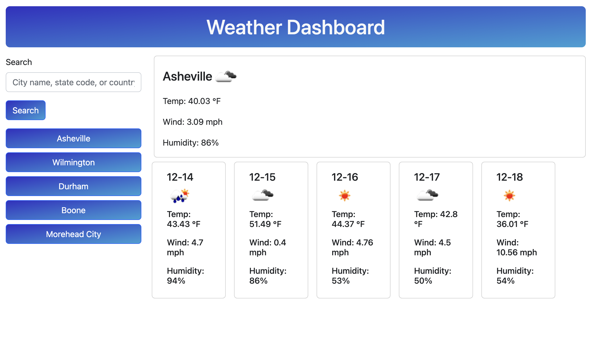

# Weather Dashboard

The Weather Dashboard is a website I built that displays a 5-day forecast for a city based on a user's search. The website will remember the cities that have been searched for and create a button below the search tool each time a new search is made. This project was built for me and anyone else who needs to check the weather in any given area!

## Table of Contents

- [Description](#description)
- [Visuals](#visuals)
- [Support](#support)

## Description

The Weather Dashboard is a web app built using Bootstrap as well as the OpenWeather API. When a user searches for a city (by city name with state code of country code), first the GeoCache API (offered by OpenWeather) gets coordinates for the queried city name. The OpenWeather API is then utilized to get weather data for that city. The app will create one main card and 5 smaller cards to display the weather for that city. The weather that is displayed includes an icon to show precipitation, temperature in F, wind in MPH, and humidity. Additionally, a button will be created for each city that is searched for. This way, users can quickly see the weather for cities they have searched for in the past.

## Visuals

## Support

If you encounter any issues with the Weather Dashboard, please reach out! My email is daniel.barto@gmail.com. Thank you!